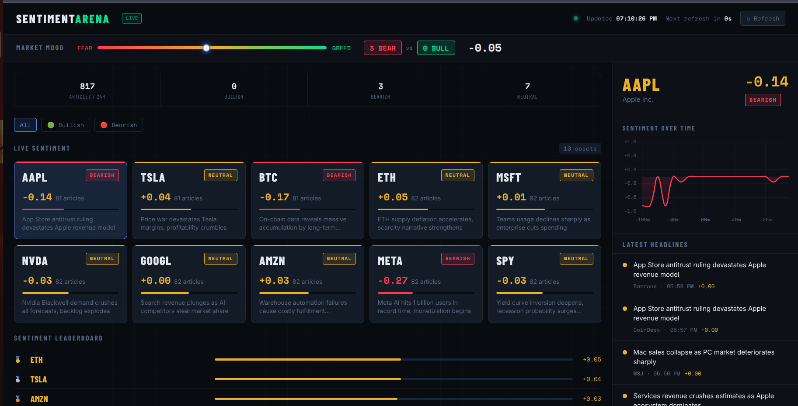

# SentimentArena — Real-Time Market Mood Engine

> **Built for the Aiven Free Tier Challenge — #AivenFreeTier**

SentimentArena is a real-time financial sentiment dashboard that streams mock market headlines through Apache Kafka, analyzes them with NLP, stores results in PostgreSQL, caches live scores in Valkey, and pushes instant updates to a browser dashboard via WebSocket — all powered by Aiven's managed cloud infrastructure.

---


## What It Does

Every 30 seconds, a news producer generates headlines for 10 major tickers (AAPL, TSLA, BTC, ETH, MSFT, NVDA, GOOGL, AMZN, META, SPY). Those headlines flow through Kafka into two consumers: one that scores them and writes live sentiment to Valkey (for real-time display), and one that persists every article and score to PostgreSQL (for history and analytics). The FastAPI backend serves a dashboard that updates live via WebSocket — no manual refresh needed.

---

## Demo Video

[Demo Video](https://youtu.be/-fdtCFwq9d8)

## Architecture

```
┌──────────────────────────────────────────────────────────────────┐
│                        Your Machine                              │
│                                                                  │
│  ┌─────────────┐     ┌──────────────────┐                        │
│  │   News      │────▶│   Kafka          │  (Aiven)              │
│  │  Producer   │     │   news.raw       │                        │
│  └─────────────┘     └────────┬─────────┘                        │
│                               │                                  │
│              ┌────────────────┼────────────────┐                 │
│              ▼                                 ▼                 │
│  ┌───────────────────┐            ┌────────────────────┐         │
│  │  Sentiment        │            │  Storage           │         │
│  │  Consumer         │            │  Consumer          │         │
│  │  (TextBlob NLP)   │            │  (Persist to PG)   │         │
│  └────────┬──────────┘            └────────┬───────────┘         │
│           │                                │                     │
│           ▼                                ▼                     │
│  ┌─────────────────┐            ┌────────────────────┐           │
│  │  Valkey         │            │  PostgreSQL        │           │
│  │  (Live Cache)   │  (Aiven)   │  (History + News)  │ (Aiven)  │
│  └────────┬────────┘            └────────────────────┘           │
│           │                                                      │
│           ▼                                                      │
│  ┌─────────────────────────────────────────────────┐             │
│  │  FastAPI Backend                                │             │
│  │  /api/sentiment  /api/mood  /api/stats          │             │
│  │  /api/news/{symbol}  WebSocket /ws              │             │
│  └────────────────────┬────────────────────────────┘             │
│                       │                                          │
│                       ▼                                          │
│              ┌─────────────────┐                                 │
│              │  Browser        │                                 │
│              │  Dashboard      │                                 │
│              │  (Live Updates) │                                 │
│              └─────────────────┘                                 │
└──────────────────────────────────────────────────────────────────┘
```

---

## Tech Stack

| Layer | Technology | Managed By |
|-------|-----------|------------|
| Message streaming | Apache Kafka | **Aiven** |
| Live cache | Valkey (Redis-compatible) | **Aiven** |
| Persistent storage | PostgreSQL | **Aiven** |
| Backend API | FastAPI + Uvicorn | Local |
| NLP | TextBlob | Local |
| Frontend | Vanilla JS + Chart.js | Local |
| Real-time push | WebSocket | Local |

---

## Project Structure

```
project/
├── main.py                      # FastAPI app, all API routes, WebSocket
├── config.py                    # Pydantic settings from .env
├── ca.pem                       # Aiven Kafka CA certificate (download from console)
├── .env                         # Your Aiven credentials (never commit this)
├── .env.example                 # Template for environment variables
├── requirements.txt
├── services/
│   ├── __init__.py
│   ├── producer.py              # Generates mock news headlines → Kafka
│   ├── sentiment_consumer.py    # Kafka → TextBlob NLP → Valkey + broadcasts to UI
│   └── storage_consumer.py      # Kafka → PostgreSQL (articles + history tables)
└── static/
    └── index.html               # The full dashboard (HTML/CSS/JS, Chart.js)
```

---

## Prerequisites

- Python 3.10 or higher
- An [Aiven account](https://console.aiven.io) (free tier works for all services)
- Three Aiven services:
  - **Kafka** — for message streaming
  - **Valkey** — for live sentiment cache
  - **PostgreSQL** — for article and history persistence

---

## Aiven Setup

### 1. Create Your Services

In the [Aiven Console](https://console.aiven.io), create three services on the **free tier**:

- **Apache Kafka** — any region
- **Valkey** — any region
- **PostgreSQL** — any region

### 2. Create the Kafka Topic

Aiven disables auto-topic-creation by default for security. You must create the topic manually:

1. Open your Kafka service in the Aiven Console
2. Click **Topics** in the left sidebar
3. Click **Add topic**
4. Set **Topic name** to `news.raw`
5. Set **Partitions** to `1`
6. Leave everything else as default
7. Click **Create topic**

### 3. Download the CA Certificate

1. Open your Kafka service
2. In the **Overview** tab, find **CA Certificate**
3. Click **Download** and save it as `ca.pem` in your project root (next to `main.py`)

> The `ca.pem` file is required for SASL_SSL authentication. Never commit it to git.

### 4. Configure IP Access

To allow your machine to connect to Aiven services:

1. For each service (Kafka, Valkey, PostgreSQL), go to **Service Settings**
2. Find **IP Allowlist** (or **Allowed IP addresses**)
3. Add `0.0.0.0/0` for open access during development
4. In production, restrict this to your server's IP

---

## Installation

```bash
# Clone the repository
git clone https://github.com/yourusername/sentimentarena.git
cd sentimentarena/project

# Install dependencies
pip install -r requirements.txt

# Download TextBlob corpora (one-time)
python3 -m textblob.download_corpora
```

---

## Configuration

Copy the example environment file and fill in your Aiven credentials:

```bash
cp .env.example .env
```

Edit `.env` with values from your Aiven Console:

```env
# Aiven Valkey
VALKEY_HOST=valkey-your-project.aivencloud.com
VALKEY_PORT=6380
VALKEY_PASSWORD=your-valkey-password
VALKEY_SSL=true

# Aiven PostgreSQL
PG_HOST=pg-your-project.aivencloud.com
PG_PORT=5432
PG_USER=avnadmin
PG_PASSWORD=your-pg-password
PG_DATABASE=defaultdb

# Aiven Kafka (SASL_SSL)
KAFKA_BOOTSTRAP_SERVERS=kafka-your-project.aivencloud.com:22039
KAFKA_USER=avnadmin
KAFKA_PASSWORD=your-kafka-password
```

> Find all these values in the **Connection Information** section of each service's Overview page in the Aiven Console.

---

## Running the Application

SentimentArena has four processes that must run simultaneously. Open four terminal tabs in your project directory.

**Terminal 1 — API Backend:**
```bash
python3 main.py
```
Look for: `✅ Connected to Valkey`, `✅ Connected to PostgreSQL`, `✅ Connected to Kafka`

**Terminal 2 — News Producer:**
```bash
python3 -m services.producer
```
Look for: `✅ Connected to Kafka (SASL)` and then `Produced news for AAPL: ...`

**Terminal 3 — Sentiment Consumer:**
```bash
python3 -m services.sentiment_consumer
```
Look for: `Updated AAPL: 0.24 (bullish)`

**Terminal 4 — Storage Consumer:**
```bash
python3 -m services.storage_consumer
```
Look for: `✅ Stored article for NVDA`

**Open the dashboard:**
```
http://localhost:8000
```

---

## One-Command Launch (for demos)

Save this as `start.sh` in the project root:

```bash
#!/bin/bash
echo "🚀 Starting SentimentArena..."
python3 main.py &
sleep 2
python3 -m services.storage_consumer &
sleep 1
python3 -m services.producer &
sleep 1
python3 -m services.sentiment_consumer &
echo "✅ All services running. Open http://localhost:8000"
wait
```

Then run:
```bash
chmod +x start.sh
./start.sh
```

To stop everything:
```bash
pkill -f "python3"
```

---

## API Reference

| Method | Endpoint | Description |
|--------|----------|-------------|
| `GET` | `/` | Serves the dashboard HTML |
| `GET` | `/api/sentiment` | Live sentiment for all 10 tickers |
| `GET` | `/api/sentiment/{symbol}/history` | Historical scores for one ticker |
| `GET` | `/api/news/{symbol}` | Latest headlines for one ticker |
| `GET` | `/api/stats` | Aggregate counts (bullish/bearish/neutral) |
| `GET` | `/api/mood` | Overall market mood score and label |
| `WS` | `/ws` | WebSocket for real-time UI updates |
| `POST` | `/internal/broadcast` | Internal endpoint for consumer → UI bridge |

---

## Dashboard Features

- **Live Mood Banner** — Fear/Greed meter that moves in real time
- **Sentiment Cards** — One card per ticker with score, label, article count, and latest headline
- **Score Bar** — Visual representation of sentiment from -1.0 to +1.0
- **Leaderboard** — Tickers ranked from most bullish to most bearish
- **Sentiment Chart** — Line chart of the last 20 scores for any selected ticker
- **News Feed** — Latest headlines with sentiment score and source, loaded from PostgreSQL
- **Filter Tabs** — Filter the grid to show only Bullish, Bearish, or All
- **Auto-refresh** — 30-second countdown with manual refresh button
- **WebSocket Updates** — Cards update in real time without page refresh

---

## How Sentiment Works

1. The producer generates a headline (e.g., *"Nvidia Blackwell demand crushes all forecasts"*)
2. TextBlob analyzes the polarity of the text (a score from -1.0 to +1.0)
3. Subjectivity is used to boost the weight of opinion-driven language
4. The score is added to a rolling 20-article window average for that ticker
5. If the window average exceeds `+0.05`, the label becomes **bullish**
6. If it falls below `-0.05`, it becomes **bearish**
7. The updated score is written to Valkey and the UI is notified via WebSocket

---

## Environment Variables Reference

| Variable | Required | Default | Description |
|----------|----------|---------|-------------|
| `VALKEY_HOST` | Yes | `localhost` | Valkey hostname from Aiven |
| `VALKEY_PORT` | Yes | `6380` | Valkey port (Aiven default: 6380) |
| `VALKEY_PASSWORD` | Yes | — | Valkey password |
| `VALKEY_SSL` | Yes | `true` | Always `true` for Aiven |
| `PG_HOST` | Yes | `localhost` | PostgreSQL hostname |
| `PG_PORT` | Yes | `5432` | PostgreSQL port |
| `PG_USER` | Yes | `avnadmin` | Database user |
| `PG_PASSWORD` | Yes | — | Database password |
| `PG_DATABASE` | Yes | `defaultdb` | Database name |
| `KAFKA_BOOTSTRAP_SERVERS` | Yes | — | Full `host:port` from Aiven Service URI |
| `KAFKA_USER` | Yes | `avnadmin` | SASL username |
| `KAFKA_PASSWORD` | Yes | — | SASL password |

---

## Security Notes

- **Never commit `.env` or `ca.pem` to version control**
- Add both to your `.gitignore`:
  ```
  .env
  ca.pem
  ```
- For production, restrict the Aiven IP Allowlist to your server's specific IP instead of `0.0.0.0/0`
- Rotate your Aiven service passwords before going public

---

## Troubleshooting

**`No module named 'config'`**
Run from the project root using `-m`:
```bash
python3 -m services.producer  # ✅
python3 services/producer.py  # ❌
```

**`SSL handshake failed`**
Ensure `ca.pem` is in the project root (same directory as `main.py`) and that you downloaded it from the Aiven Kafka service overview page.

**`KafkaTimeoutError: Failed to update metadata`**
The Kafka topic `news.raw` doesn't exist. Create it manually in the Aiven Console under **Topics → Add topic**.

**`password authentication failed for user "avnadmin"`**
Copy the password directly from the Aiven Console. The PostgreSQL database name is usually `defaultdb` unless you created a custom one.

**Dashboard shows all Neutral**
Wait at least 2–3 minutes for the producer to complete a round and for the sentiment consumer to process and write to Valkey. Then click **↻ Refresh** on the dashboard.

**`Request timeout must be larger than session timeout`**
Both `request_timeout_ms` and `session_timeout_ms` are set in the consumer. The request timeout must be at least 1ms larger. The correct values are `request_timeout_ms=30001` and `session_timeout_ms=30000`.

---

## License

MIT — use freely, build on top of it, and share what you make.

---

*Built with ❤️ using Aiven's free tier — Kafka, Valkey, and PostgreSQL doing the heavy lifting.*

**#AivenFreeTier**